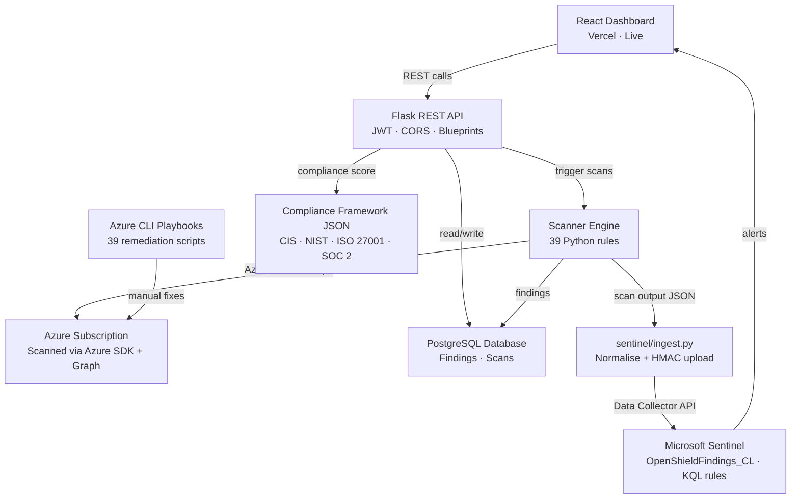

# OpenShield

> **Open source Cloud Security Posture Management (CSPM) for Azure - detect misconfigurations, map to CIS/NIST/ISO27001/SOC2, fix them with one command, and identify cryptographic assets requiring quantum-safe migration.**

[](https://github.com/openshield-org/openshield/stargazers)
[](https://github.com/openshield-org/openshield/network/members)
[](https://github.com/openshield-org/openshield/graphs/contributors)
[](https://github.com/openshield-org/openshield/commits/main)
[](https://github.com/openshield-org/openshield/issues)
[](LICENSE)
[](https://www.python.org/downloads/release/python-3110/)
[](https://github.com/openshield-org/openshield/actions/workflows/ci.yml)
[](https://github.com/openshield-org/openshield/actions/workflows/deploy.yml)
[](.github/SECURITY.md)
[](https://owasp.org)
[](CONTRIBUTING.md)
[](https://discord.gg/openshield)

---

## The Problem

Enterprise cloud security tools like **Wiz**, **Prisma Cloud**, and **Microsoft Defender for Cloud** cost **$50,000–$500,000/year**.

Startups, SMEs, universities, and student teams are left with **zero visibility** into their Azure security posture. A misconfigured storage blob, an overprivileged service principal, or an open NSG rule can sit undetected for months.

**OpenShield changes that.**

## Why Post-Quantum Cryptography Matters Now

Adversaries are collecting encrypted Azure traffic today to decrypt it when quantum computers become available. This is called a Harvest Now Decrypt Later attack and it is happening right now.

OpenShield scans Azure for classical cryptographic assets that need migration before it is too late:

- TLS configurations using RSA or ECDH key exchange on App Services
- Key Vault keys using RSA or ECC algorithms vulnerable to Shor's algorithm
- Certificates using classical signature algorithms

Findings map to NIST FIPS 203 (ML-KEM), FIPS 204 (ML-DSA), and FIPS 205 (SLH-DSA) and feed directly into post-quantum migration planning.

---

## What OpenShield Does

| Feature | Description |
|---|---|
| **Misconfiguration Scanner** | Runs 39 Azure security rules across storage, network, identity, database, compute, Key Vault, and post-quantum cryptography |
| **Compliance Mapper** | Maps findings to CIS Benchmarks, NIST CSF, ISO 27001, and SOC 2 framework JSON files |
| **Scan History API** | Stores scans and findings in PostgreSQL and exposes findings, score, scan history, compliance posture, drift, and resource inventory over REST |
| **Remediation Playbooks** | Every rule ships with a matching Azure CLI remediation script (36 playbooks) |
| **Security Dashboard** | Full React dashboard deployed on Vercel — live monitoring, findings, compliance, drift, prioritization, and AI-layer views |
| **Project Website** | Documentation and reference site at [openshield-website.vercel.app](https://openshield-website.vercel.app) — blog, rules gallery, docs, roadmap, releases, and interactive playground |
| **Sentinel Integration** | Normalises findings and pushes them into Microsoft Sentinel via a Log Analytics custom table and KQL analytics rules |

---

## Architecture



## Live Demo

| Service | URL |
|---|---|
| **Security Dashboard** (Vercel) | `https://openshield-gules.vercel.app` |
| **REST API** (Render) | `https://openshield-api.onrender.com` |
| **Project Website** | `https://openshield-website.vercel.app` |

> **Note:** The API is hosted on Render. The dashboard connects automatically on load and shows live data from the PostgreSQL database.

> [!IMPORTANT]
> **Security Requirement:** Production deployments **fail at startup** if `JWT_SECRET` is missing, set to the insecure default, or shorter than 32 characters. Generate a strong secret with:
> ```
> python -c "import secrets; print(secrets.token_urlsafe(32))"
> ```
> Set `OPENSHIELD_ENV=production` (or rely on Render's automatic `RENDER=true`) to enable this enforcement. Local development runs without these signals are allowed to use the default with a warning.

---

## Tech Stack

| Layer | Technology | Cost |
|---|---|---|
| Project Website | Static HTML + Tailwind CDN, deployed on Vercel | Free |
| Security Dashboard | React + Vite + Tailwind, deployed on Vercel | Free |
| Backend API | Python + Flask | Free |
| Database | PostgreSQL | Render managed PostgreSQL |
| Cloud Scanner | Python + Azure SDK | Free |
| Remediation | Azure CLI playbooks | Free |
| SIEM | Microsoft Sentinel | 90-day free trial |
| CI/CD | GitHub Actions | Free |
| Repo | GitHub | Free |

---

## Project Structure

```
openshield/
├── scanner/               # Azure misconfiguration rule engine
│   ├── rules/             # Individual scan rules (contribute here!)
│   ├── engine.py          # Core scanning orchestration
│   └── azure_client.py    # Azure SDK wrapper
├── compliance/            # Framework mapping engine
│   └── frameworks/        # CIS, NIST, ISO 27001, SOC 2 mappings
├── playbooks/             # Remediation playbooks
│   ├── arm/               # Reserved for future ARM templates
│   ├── terraform/         # Reserved for future Terraform fixes
│   └── cli/               # Azure CLI scripts
├── api/                   # Flask REST API
│   ├── routes/
│   └── models/
├── frontend/              # React security dashboard (Vercel)
├── website/               # Project website — docs, blog, rules gallery (Vercel)
├── sentinel/              # Sentinel integration & KQL rules
├── .github/workflows/     # CI checks
├── docs/                  # Documentation
├── CONTRIBUTING.md
└── README.md
```

---


## Quick Start

**Backend (Flask API + Scanner)**

```bash
# Clone the repo
git clone https://github.com/openshield-org/openshield.git
cd openshield

# Install Python dependencies
pip install -r requirements.txt

# Set your Azure credentials
export AZURE_SUBSCRIPTION_ID=your-subscription-id
export AZURE_CLIENT_ID=your-client-id
export AZURE_CLIENT_SECRET=your-client-secret
export AZURE_TENANT_ID=your-tenant-id
export JWT_SECRET=your-strong-secret   # used to protect write endpoints (scan trigger, AI)

# Run a scan
python -c "
from scanner.engine import ScanEngine
import json, os
result = ScanEngine(os.environ['AZURE_SUBSCRIPTION_ID']).run_scan()
print(json.dumps(result, indent=2))
"

# Start the API
FLASK_APP=api/app.py flask run
```

**Frontend (React dashboard)**

```bash
cd frontend
npm install

# Local dev — points at http://localhost:5000 by default
npm run dev

# To develop against the live Render backend:
VITE_API_URL=https://openshield-api.onrender.com npm run dev
```

No token required — all read endpoints are public. Only scan trigger and AI endpoints require a JWT (POST only).

---

## Contributing

We actively welcome contributions from students and developers at all levels.

**Ways to contribute:**
- Add a new misconfiguration scan rule
- Add a compliance framework mapping
- Write a remediation playbook
- Fix a bug
- Improve documentation

See [CONTRIBUTING.md](CONTRIBUTING.md) for a full guide — including how to add your first rule in under 30 minutes.

Contributors are credited below.

---

## Roadmap

- [x] Project scaffolding
- [x] Core scanner engine (Azure SDK integration)
- [x] 30+ scan rules
- [x] Flask API + PostgreSQL schema
- [x] Post-quantum cryptography scanner (AZ-PQC-001 to AZ-PQC-003)
- [x] React dashboard (live on Vercel)
- [x] CIS Benchmark compliance mapping
- [x] SOC 2 compliance mapping
- [x] Sentinel alert integration
- [x] Real-world breach scenarios documented
- [x] First external contributor PR merged
- [x] Azure CLI remediation playbook library
- [x] NIST CSF + ISO 27001 mappings
- [x] GitHub Actions CI pipeline
- [x] Project website with docs, blog, rules gallery, and playground
- [x] Live end-to-end data wiring (all API endpoints serving real data)
- [ ] Multi-cloud support (AWS, GCP)

---

## License

MIT — free to use, modify, and distribute.

---

> Built by security engineers and students who believe cloud security tooling should be accessible to everyone.

---

## Learn OpenShield

Full documentation, the security rules gallery, blog, and interactive playground are available at the project website:

**[openshield-website.vercel.app](https://openshield-website.vercel.app)**
