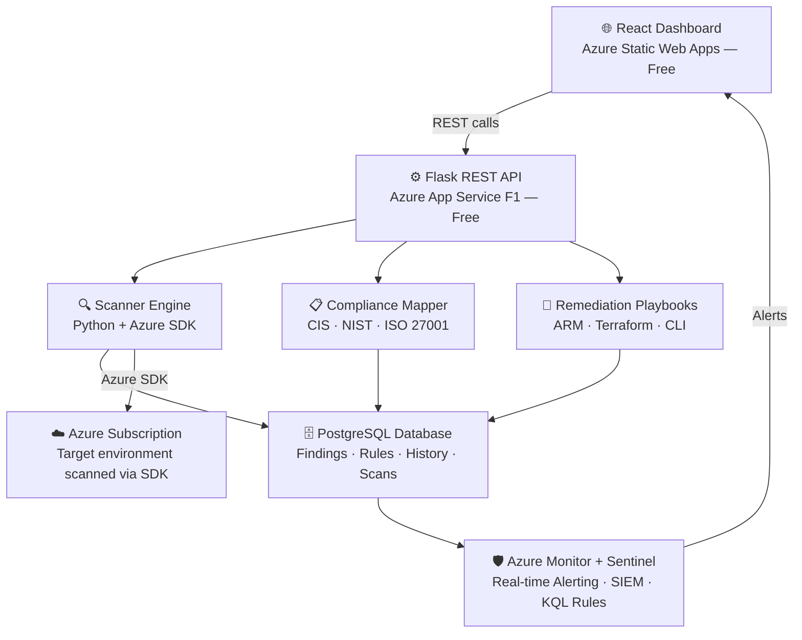

# 🛡️ OpenShield

> **Open source Cloud Security Posture Management (CSPM) for Azure — built by the community, for the community.**

[](https://opensource.org/licenses/MIT)
[](CONTRIBUTING.md)
[](https://github.com/openshield-org/openshield/issues?q=is%3Aissue+label%3Agood-first-issue)
[](https://discord.gg/openshield)

---

## The Problem

Enterprise cloud security tools like **Wiz**, **Prisma Cloud**, and **Microsoft Defender for Cloud** cost **$50,000–$500,000/year**.

Startups, SMEs, universities, and student teams are left with **zero visibility** into their Azure security posture. A misconfigured storage blob, an overprivileged service principal, or an open NSG rule can sit undetected for months.

**OpenShield changes that.**

---

## What OpenShield Does

| Feature | Description |
|---|---|
| **Misconfiguration Scanner** | Scans your Azure subscription for real security issues — open blobs, weak NSG rules, unencrypted DBs, overprivileged identities |
| **Compliance Mapper** | Maps every finding to CIS Benchmarks, NIST CSF, ISO 27001, and SOC 2 |
| **Drift Detection** | Monitors your environment continuously — alerts when security posture changes |
| **Remediation Playbooks** | Every finding ships with a one-click fix — ARM template, Azure CLI, or Terraform |
| **Security Dashboard** | React frontend showing risk score, open findings, compliance posture, and trend over time |
| **Sentinel Integration** | Pushes alerts into Microsoft Sentinel for full SIEM visibility |

---

## 🏗️ Architecture



## Tech Stack

| Layer | Technology | Cost |
|---|---|---|
| Frontend | React + Tailwind CSS | Free |
| Backend API | Python + Flask | Free |
| Database | PostgreSQL | Free (Render/Azure free tier) |
| Cloud Scanner | Python + Azure SDK | Free |
| Infrastructure | Azure App Service F1 | Free |
| Static Hosting | Azure Static Web Apps | Free forever |
| SIEM | Microsoft Sentinel | 90-day free trial |
| CI/CD | GitHub Actions | Free |
| Repo | GitHub | Free |

---

## Project Structure

```
openshield/
├── scanner/               # Azure misconfiguration rule engine
│   ├── rules/             # Individual scan rules (contribute here!)
│   ├── engine.py          # Core scanning orchestration
│   └── azure_client.py    # Azure SDK wrapper
├── compliance/            # Framework mapping engine
│   ├── frameworks/        # CIS, NIST, ISO 27001, SOC 2 mappings
│   └── mapper.py          # Maps findings to frameworks
├── playbooks/             # Remediation playbooks
│   ├── arm/               # ARM templates
│   ├── terraform/         # Terraform fixes
│   └── cli/               # Azure CLI scripts
├── api/                   # Flask REST API
│   ├── routes/
│   └── models/
├── frontend/              # React dashboard
│   ├── src/
│   └── public/
├── sentinel/              # Sentinel integration & KQL rules
├── docs/                  # Documentation
├── CONTRIBUTING.md
└── README.md
```

---


## Quick Start

```bash
# Clone the repo
git clone https://github.com/openshield-org/openshield.git
cd openshield

# Install Python dependencies
pip install -r requirements.txt

# Set your Azure credentials
export AZURE_SUBSCRIPTION_ID=your-subscription-id
export AZURE_CLIENT_ID=your-client-id
export AZURE_CLIENT_SECRET=your-client-secret
export AZURE_TENANT_ID=your-tenant-id

# Run a scan
python scanner/engine.py --subscription $AZURE_SUBSCRIPTION_ID

# Start the API
cd api && flask run

# Start the dashboard
cd frontend && npm install && npm run dev
```

---

## 🤝 Contributing

We actively welcome contributions from students and developers at all levels.

**Ways to contribute:**
- 🔍 Add a new misconfiguration scan rule
- 📋 Add a compliance framework mapping
- 🔧 Write a remediation playbook
- 🐛 Fix a bug
- 📖 Improve documentation

👉 See [CONTRIBUTING.md](CONTRIBUTING.md) for a full guide — including how to add your first rule in under 30 minutes.

All contributors get credited in our [CONTRIBUTORS.md](CONTRIBUTORS.md).

---

## 📍 Roadmap

- [x] Project scaffolding
- [ ] Core scanner engine (Azure SDK integration)
- [ ] First 10 misconfiguration rules
- [ ] Flask API + PostgreSQL schema
- [ ] React dashboard MVP
- [ ] CIS Benchmark compliance mapping
- [ ] Sentinel alert integration
- [ ] Remediation playbook library
- [ ] NIST CSF + ISO 27001 mappings
- [ ] Multi-cloud support (AWS, GCP)

---

## 📄 License

MIT — free to use, modify, and distribute.

---

> Built with ❤️ by security engineers and students who believe cloud security tooling should be accessible to everyone.

---

## 📚 Learn OpenShield

Explore the OpenShield learning portal to understand:

- Azure CSPM fundamentals
- OpenShield architecture
- Compliance mappings
- Remediation workflows
- Contributor onboarding
- Documentation navigation

👉 [OpenShield Learn](docs/learn/index.html)